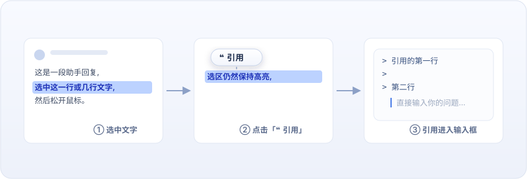

<div align="center">



# dsh-quote-selection

**❝ 选中即引用 · DeepSeek Harness Web UI 插件**

[](https://github.com/lianginx/dsh-quote-selection/tags)
[](LICENSE)


**一行安装**

```sh
dsh plugin --profile web add github:lianginx/dsh-quote-selection
```

[特性](#特性) · [安装](#安装) · [使用](#使用) · [工作原理](#工作原理) · [English](#english)

</div>

---

参考 ChatGPT 网页端“询问 ChatGPT”的交互:选中对话里的一行或多行文字,选区第一行顶部浮出「❝ 引用」按钮,点击后选中内容以 Markdown 块引用(`>`)写入输入框,光标停在引用块下一行——直接开始提问。

## 特性

- **❝ 浮动引用按钮** —— 选中会话文字即出现,悬停有浅色反馈;滚动、缩放、点击别处自动消失
- **规范的 Markdown 输出** —— 每行一个 `> `,多行选择自动带 `>` 续行符,发送后渲染为标准块引用
- **连续引用** —— 再次引用自动追加,两段之间恰好空一行,方便针对多段内容提问
- **走正门写入** —— 通过输入机器的公开写路径 `setDraft` 写入草稿,撤销栈、字数统计等既有机制不受影响
- **零依赖、零构建** —— 纯 JavaScript 直发,GitHub 安装不需要 pnpm `allowBuilds` 构建授权

## 安装

```sh
# 从 GitHub 安装(推荐 pin 到具体 commit)
dsh plugin --profile web add github:lianginx/dsh-quote-selection
# 或锁定版本:
dsh plugin --profile web add github:lianginx/dsh-quote-selection#v0.1.0

dsh --profile web   # 或 dsh web
```

本地开发安装(本仓库与 deepseek-harness 为兄弟目录时):

```sh
dsh plugin --profile web add ../dsh-quote-selection
```

> `add` 使用 `link:` 语义链接本仓库,改动 `client.js` 后重启 `dsh web` 即可生效,无需重装。

要求:`node ^22.19 || >=24`,profile 包含官方 `@deepseek-ai/dsh-web-app` 层(`web` 模板自带)。

## 使用

1. 在任意回复中选中一段文字(单行或多行);
2. 点击浮出的「❝ 引用」按钮;
3. 输入框出现:

   ```markdown
   > 引用的第一行
   >
   > 第二行
   ```

   光标停在引用块下方一行,直接打字提问;
4. 再次选中别处文字再点一次,新引用块以一个空行分隔追加。

### 卸载 / 升级

```sh
dsh plugin --profile web remove dsh-quote-selection
dsh plugin --profile web update dsh-quote-selection
```

## 工作原理

| 组成 | 座位 / 机制 |
|---|---|
| 浮动按钮 | `shell.overlay`(list 座位,可加性、默认点击穿透),选区校验基于产品锚点 `[data-conversation-scroll]` / `[data-composer-seat]` |
| 草稿写入 | `conversation.composer.dock` 座位上的隐形桥组件持有 `inputActions.setDraft`(输入机器唯一公开写路径) |
| 样式 | 工厂闭包内注入带 `data-plugin` 标签的样式表,复用主题 token(`--dsw-alias-*`),深浅色自适应 |
| 定时器 | Cordis `timer` 服务(`inject: ['timer']`),不触碰原生定时器 |

浏览器半边只依赖基线模块表(`react`)与 Cordis 服务(`slots`、`timer`),无任何其他 `@deepseek-ai/*` 值依赖;包结构遵循 DSH 插件发布规范([publish 教程](https://github.com/deepseek-ai/deepseek-harness/blob/master/docs/user/develop/basic/publish.md)):manifest 双声明 `dsh.bundle.patch` + `dsh.client { platform: 'web' }`,patch 只 insert 新行。

## English

A [DeepSeek Harness](https://github.com/deepseek-ai/deepseek-harness) Web UI plugin inspired by ChatGPT's "Ask ChatGPT" selection popover: select any text in the conversation, click the floating **❝ 引用 (Quote)** button, and the selection lands in the composer as a Markdown blockquote with the caret ready below it. Repeated quotes join with exactly one blank line.

```sh
dsh plugin --profile web add github:lianginx/dsh-quote-selection
```

Zero dependencies, zero build scripts — installing from GitHub runs no code and needs no pnpm `allowBuilds` permission.

## License

[MIT](LICENSE)
