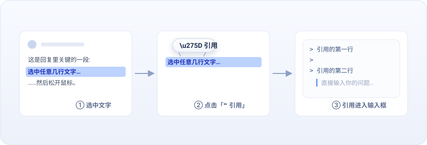

<div align="center">


# dsh-quote-selection

**❝ Quote selected chat text into the composer · A DeepSeek Harness Web UI plugin**

[](https://github.com/lianginx/dsh-quote-selection/tags)
[](LICENSE)


**Install**

```sh
dsh plugin --profile web add github:lianginx/dsh-quote-selection
```

[Features](#features) · [Install](#install) · [Usage](#usage) · [How it works](#how-it-works) · **[简体中文](#简体中文)**

</div>

---

Inspired by ChatGPT's "Ask ChatGPT" selection popover: select any text in a conversation reply — one line or many — and a floating **❝ 引用 (Quote)** button appears above the selection's first line. Click it and the selection lands in the composer as a Markdown blockquote, with the caret ready on the line right below. Type your follow-up question immediately.

## Features

- **Floating quote button** — appears on selection over conversation text; hides on scroll, resize, or clicking elsewhere
- **Clean Markdown output** — one `> ` per line; multi-line selections carry proper `>` continuation lines and render as a standard blockquote after sending
- **Chained quotes** — quoting again appends a new block separated by exactly one blank line, handy for asking about several passages at once
- **Writes through the front door** — inserts via `inputActions.setDraft`, the input machine's single public write path, so undo history, reference chips, and draft stats all keep working
- **Zero dependencies, zero build** — plain JavaScript shipped as-is; installing from GitHub runs no code and needs no pnpm `allowBuilds` permission

## Install

```sh
# From GitHub (pinning to a tag or commit is recommended)
dsh plugin --profile web add github:lianginx/dsh-quote-selection
# Or locked:
dsh plugin --profile web add github:lianginx/dsh-quote-selection#v0.1.0

dsh --profile web   # or: dsh web
```

Local development install (with this checkout kept next to deepseek-harness):

```sh
dsh plugin --profile web add ../dsh-quote-selection
```

> `add` links the checkout (`link:` semantics), so editing `client.js` takes effect after restarting `dsh web` — no reinstall needed.

Requires `node ^22.19 || >=24` and a profile containing the official `@deepseek-ai/dsh-web-app` layer (the shipped `web` template has it).

## Usage

1. Select some text in any assistant reply;
2. Click the floating **❝ 引用** button;
3. The composer now holds:

   ```markdown
   > The quoted first line
   >
   > The second line
   ```

   with the caret on the line below — start typing your question;
4. Select other text and quote again: the new block joins with exactly one blank line between quotes.

### Uninstall / upgrade

```sh
dsh plugin --profile web remove dsh-quote-selection
dsh plugin --profile web update dsh-quote-selection
```

## How it works

| Piece | Slot / mechanism |
|---|---|
| Floating button | `shell.overlay` (additive list slot, click-through by default); selection validated against the product anchors `[data-conversation-scroll]` / `[data-composer-seat]` |
| Draft write | An invisible bridge component on `conversation.composer.dock` holding `inputActions.setDraft` — the input machine's only public write path |
| Styling | A `data-plugin`-tagged stylesheet injected inside the factory closure, built on theme tokens (`--dsw-alias-*`) so light and dark both adapt |
| Timers | The Cordis `timer` service (`inject: ['timer']`); no native timer globals |

The browser half depends only on baseline module-table entries (`react`) and Cordis services (`slots`, `timer`) — no other `@deepseek-ai/*` value imports. The package follows the DSH publishing conventions ([publish tutorial](https://github.com/deepseek-ai/deepseek-harness/blob/master/docs/user/develop/basic/publish.md)): manifest dual declaration `dsh.bundle.patch` + `dsh.client { platform: 'web' }`, and a patch that only inserts rows.

---

## 简体中文



一个 [DeepSeek Harness](https://github.com/deepseek-ai/deepseek-harness) Web UI 插件,参考 ChatGPT 网页端“询问 ChatGPT”的交互:在会话回复中选中一行或多行文字,选区第一行顶部浮出「❝ 引用」按钮,点击后选中内容以 Markdown 块引用写入输入框,光标停在引用块下一行——直接输入提问。

```sh
dsh plugin --profile web add github:lianginx/dsh-quote-selection
```

### 特性

- **❝ 浮动引用按钮** —— 选中会话文字即出现,悬停有浅色反馈;滚动、缩放、点击别处自动消失
- **规范的 Markdown 输出** —— 每行一个 `> `,多行选择自动带 `>` 续行符,发送后渲染为标准块引用
- **连续引用** —— 再次引用自动追加,两段之间恰好空一行,方便针对多段内容提问
- **走正门写入** —— 通过输入机器的公开写路径 `setDraft` 写入草稿,撤销栈、引用 chip、字数统计等既有机制不受影响
- **零依赖、零构建** —— 纯 JavaScript 直发,GitHub 安装不触发任何代码执行,无需 pnpm `allowBuilds` 构建授权

### 使用

1. 在任意回复中选中一段文字(单行或多行);
2. 点击浮出的「❝ 引用」按钮;
3. 输入框出现:

   ```markdown
   > 引用的第一行
   >
   > 第二行
   ```

   光标停在引用块下方一行,直接打字提问;
4. 再次选中别处文字再点一次,新引用块与上一段之间恰好空一行。

### 卸载 / 升级

```sh
dsh plugin --profile web remove dsh-quote-selection
dsh plugin --profile web update dsh-quote-selection
```

### 工作原理

浮层按钮注册在 `shell.overlay`(list 座位,可加性、默认点击穿透),选区校验基于产品自带锚点 `[data-conversation-scroll]` / `[data-composer-seat]`;草稿通过 `conversation.composer.dock` 座位上的隐形桥组件调用输入机器的唯一公开写路径 `inputActions.setDraft`;样式表带 `data-plugin` 标签注入并复用主题 token(`--dsw-alias-*`),深浅色自适应;定时使用 Cordis `timer` 服务。浏览器半边只依赖基线模块表(`react`)与 Cordis 服务(`slots`、`timer`),无任何其他 `@deepseek-ai/*` 值依赖。包结构遵循 DSH 插件发布规范([中文发布教程](https://github.com/deepseek-ai/deepseek-harness/blob/master/docs/user/develop/basic/publish.zh.md)):manifest 双声明 `dsh.bundle.patch` + `dsh.client { platform: 'web' }`,patch 只 insert 新行。

## License

[MIT](LICENSE)
